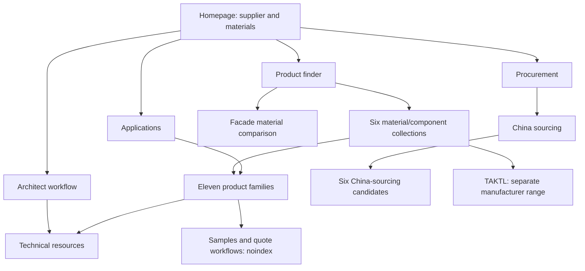

# Cladvera SEO architecture and URL audit

Audit date: 2026-10-10. English-only published site.

**55 page URLs audited: 23 intended indexable pages, 3 utility pages, 2 redirect aliases and 27 unreviewed legacy pages.** The technical checklist average is **99.7 → 100.0 / 100** across the same 23 intended indexable pages. Separately, all 27 legacy pages changed from crawler-blocked HTTP 200 content to crawlable HTTP 404 responses, and both permanent redirects are now crawlable.

**100 means the checks listed below passed. It does not mean complete SEO performance, a Google score, a Lighthouse score, or a ranking/traffic prediction.** The published site was already technically strong before this change. Its most important improvements were publication control and useful page-specific content.

[Full 55-URL CSV](url-scorecard.csv) · [Before crawl](before.json) · [After crawl](after.json)

## Evidence and scope

- Before: public production, `https://cladvera.vercel.app`, captured `2026-10-10T13:49:44.051470+00:00`.
- After: local production build, `http://localhost:3006`, captured `2026-10-10T13:49:22.282482+00:00`; canonical origin independently checked against `https://cladvera.vercel.app`.
- Public release verification is performed after deployment; these snapshots preserve the pre-deployment comparison.
- HTTP HTML, metadata, status codes, robots rules, sitemap, JSON-LD syntax/selected relationships and internal links were inspected. Redirects are recorded; link checks accept a successfully resolved destination.
- 82 distinct internal link targets were checked after the change, including linked query URLs and asset/document targets. External source URLs were not link-audited in this crawl.
- Search Console impressions/clicks/index coverage, backlinks, keyword volume, conversion data and field Core Web Vitals were unavailable and are not scored. Actual Google indexing cannot be inferred from these checks.
- Visible FAQ answers remain useful content. No points are awarded for FAQ rich-result eligibility, llms.txt, keyword density, word count or fabricated offers/reviews. Google ended FAQ rich results in May 2026 and says llms.txt does not affect its rankings. [Google documentation updates](https://developers.google.com/search/updates)

## Architecture and intent



Every search page is reachable within two HTML-link steps from the homepage. All 23 have at least two contextual incoming source pages, except the homepage which is exempt from that criterion. Navigation/footer links are excluded from the contextual count. Query-filter combinations remain outside the sitemap and crawler-blocked; clean collection/product links provide discovery.

The URLs were preserved. In particular, the interior-board URLs still contain the historical `interior-hpl-panels` segment, but page titles and visible content identify decorative boards and explicitly state that HPL classification is unconfirmed. A URL migration would require a separate coordinated redirect decision; inserting more keywords into slugs is not an automatic ranking improvement. [Google SEO guidance](https://developers.google.com/search/docs/fundamentals/seo-starter-guide)

## Scoring rubric

Weights are project-specific checklist priorities, not Google ranking weights. Each check is pass/fail; no subjective editorial points are added. The same rubric is used before and after.

| Category | Points | Checks |
| --- | ---: | --- |
| Crawl and indexing configuration |30| Direct HTTP 200 (5), canonical path crawlable (10), HTML/HTTP permit indexing (10), exactly one sitemap entry (5) |
| Metadata |20| Unique nonempty title ≤ 60 characters (8), unique description 120–160 characters (6), one self canonical (6) |
| Architecture |20| At least two contextual incoming pages (8; home exempt), depth ≤ 2 (4), contextual onward search-page link (4), internal targets/fragments resolve (4) |
| Page semantics |20| One nonempty H1 (6), JSON-LD page entity with canonical URL and website relationship (8), breadcrumb list ending at current URL (6; home exempt) |
| Content access |10| English lang (3), image alt attributes present (3; empty decorative alt allowed), nonempty server-rendered main text (4) |

Title/description lengths are this repository’s editorial limits, not Google-mandated lengths. H1 count and schema presence are consistency checks. The schema check does not validate all Schema.org properties or establish rich-result eligibility. Alt-text quality, comprehensive accessibility and content usefulness require separate review.

## Every indexable URL

Each score is out of 100. The only automated deficit before the change was the missing page entity on `/products`. Editorial notes document work beyond the numerical checklist.

| URL | Before | After | Search intent and change |
| --- | ---: | ---: | --- |
| [/sourcing/china](https://cladvera.vercel.app/sourcing/china) |100|100| **China architectural panel sourcing and export supply**. Retained China-sourcing scope, importer questions and separate TAKTL positioning. |
| [/guides/facade-materials](https://cladvera.vercel.app/guides/facade-materials) |100|100| **ACM vs HPL vs UHPC vs GFRP facade materials**. Added contextual incoming links from finder and facade applications; retained comparison ownership. |
| [/products](https://cladvera.vercel.app/products) |92|100| **Architectural panel product finder**. Added CollectionPage entity and contextual material-comparison link. |
| [/applications](https://cladvera.vercel.app/applications) |100|100| **Facade and interior panel applications**. Clarified architect-workflow anchor; added facade material-guide and sample links. |
| [/procurement](https://cladvera.vercel.app/procurement) |100|100| **Architectural panel procurement and RFQ**. Added sample, specification and document-review links before order release. |
| [/materials/gfrp-custom-elements](https://cladvera.vercel.app/materials/gfrp-custom-elements) |100|100| **Custom GFRP; GRP architectural elements**. Retained one useful geometry/tooling dossier rather than creating thin synonym pages. |
| [/](https://cladvera.vercel.app/) |100|100| **Facade panel supplier; architectural materials**. Added visible supplier and US/Canada context under the editorial heading. |
| [/materials/exterior-hpl-panels](https://cladvera.vercel.app/materials/exterior-hpl-panels) |100|100| **Exterior HPL facade panels**. Retained exterior material selection intent and manufacturer-source links. |
| [/materials/exterior-hpl-panels/wood-fiber-facade](https://cladvera.vercel.app/materials/exterior-hpl-panels/wood-fiber-facade) |100|100| **Compactwood wood-fiber HPL facade board**. Retained specific product construction and document-review role. |
| [/suppliers/taktl](https://cladvera.vercel.app/suppliers/taktl) |100|100| **TAKTL architectural UHPC panels**. Retained named-manufacturer collection intent; individual families own specification details. |
| [/suppliers/taktl/facade-elements](https://cladvera.vercel.app/suppliers/taktl/facade-elements) |100|100| **TAKTL UHPC facade elements**. Added panel schedule, surface-sample and attachment coordination guidance. |
| [/suppliers/taktl/korsa-aggregate](https://cladvera.vercel.app/suppliers/taktl/korsa-aggregate) |100|100| **TAKTL KORSA exposed aggregate panels**. Added aggregate brief, physical sample and panel-schedule guidance. |
| [/suppliers/taktl/sola](https://cladvera.vercel.app/suppliers/taktl/sola) |100|100| **TAKTL SOLA photocatalytic surface panels**. Added S01/S02 selection, performance-evidence and maintenance questions. |
| [/suppliers/taktl/custom-elements](https://cladvera.vercel.app/suppliers/taktl/custom-elements) |100|100| **Custom UHPC architectural elements**. Added pattern/model, repeated geometry, tooling and mock-up decisions. |
| [/suppliers/taktl/hardware](https://cladvera.vercel.app/suppliers/taktl/hardware) |100|100| **TAKTL facade panel attachment components**. Added visible/concealed attachment, substrate and coordinated component-list guidance. |
| [/materials/acm-panels](https://cladvera.vercel.app/materials/acm-panels) |100|100| **ALMINE metal composite panels; MCM and ACM**. Retained material overview and terminology distinction; no blanket aluminum-face assumption. |
| [/materials/acm-panels/a2-fireproof](https://cladvera.vercel.app/materials/acm-panels/a2-fireproof) |100|100| **ALMINE A2 metal composite panels**. Added face/core identification, fabrication scope and construction-specific fire evidence. |
| [/materials/acm-panels/tunnel-traffic](https://cladvera.vercel.app/materials/acm-panels/tunnel-traffic) |100|100| **Transit and tunnel wall panels**. Added installation environment, cleaning and transit-authority submission guidance. |
| [/materials/acm-panels/medical-antibacterial](https://cladvera.vercel.app/materials/acm-panels/medical-antibacterial) |100|100| **Healthcare interior metal wall panels**. Added finish-specific cleaning, antibacterial test identification and interior construction review. |
| [/materials/interior-hpl-panels](https://cladvera.vercel.app/materials/interior-hpl-panels) |100|100| **Interior decorative wall and ceiling boards**. Retained truthful interior-board classification; HPL is not confirmed by the source. |
| [/materials/interior-hpl-panels/paste-special-board](https://cladvera.vercel.app/materials/interior-hpl-panels/paste-special-board) |100|100| **Compactwood interior wall and ceiling board**. Clarified title/H1/description; preserved Paste Special Board identity and HPL qualification. |
| [/architects](https://cladvera.vercel.app/architects) |100|100| **Architectural panel selection and specification**. Retained design-team workflow; procurement now links directly to specification notes. |
| [/technical-resources](https://cladvera.vercel.app/technical-resources) |100|100| **Architectural panel technical documents**. Retained source/document distinctions and filter canonical; added incoming review-package link. |

## Utility pages and retired URLs

**N/A is intentional, not zero.** These URLs have no target organic-landing-page score. Utilities retain noindex; aliases consolidate into canonical hubs; unfinished pages return 404 without exposing their old product claims. Allowing crawlers to observe the response is distinct from allowing indexation. [Google noindex guidance](https://developers.google.com/search/docs/crawling-indexing/block-indexing)

| URL | Role | Before HTTP | After HTTP | After crawl control |
| --- | --- | ---: | ---: | --- |
| [/compare](https://cladvera.vercel.app/compare) |utility; N/A|200|200|Crawlable; noindex|
| [/materials](https://cladvera.vercel.app/materials) |redirect; N/A|308|308|Crawlable permanent redirect|
| [/materials/uhpc-panels](https://cladvera.vercel.app/materials/uhpc-panels) |draft; N/A|200|404|Crawlable 404; not in sitemap|
| [/materials/wood-veneer-panels](https://cladvera.vercel.app/materials/wood-veneer-panels) |draft; N/A|200|404|Crawlable 404; not in sitemap|
| [/finishes](https://cladvera.vercel.app/finishes) |draft; N/A|200|404|Crawlable 404; not in sitemap|
| [/finishes/wood-grain](https://cladvera.vercel.app/finishes/wood-grain) |draft; N/A|200|404|Crawlable 404; not in sitemap|
| [/finishes/textured-concrete](https://cladvera.vercel.app/finishes/textured-concrete) |draft; N/A|200|404|Crawlable 404; not in sitemap|
| [/for-contractors](https://cladvera.vercel.app/for-contractors) |redirect; N/A|308|308|Crawlable permanent redirect|
| [/compliance](https://cladvera.vercel.app/compliance) |draft; N/A|200|404|Crawlable 404; not in sitemap|
| [/systems](https://cladvera.vercel.app/systems) |draft; N/A|200|404|Crawlable 404; not in sitemap|
| [/fabrication](https://cladvera.vercel.app/fabrication) |draft; N/A|200|404|Crawlable 404; not in sitemap|
| [/stock-and-lead-times](https://cladvera.vercel.app/stock-and-lead-times) |draft; N/A|200|404|Crawlable 404; not in sitemap|
| [/supply-and-delivery](https://cladvera.vercel.app/supply-and-delivery) |draft; N/A|200|404|Crawlable 404; not in sitemap|
| [/warranty](https://cladvera.vercel.app/warranty) |draft; N/A|200|404|Crawlable 404; not in sitemap|
| [/pricing-guide](https://cladvera.vercel.app/pricing-guide) |draft; N/A|200|404|Crawlable 404; not in sitemap|
| [/canada](https://cladvera.vercel.app/canada) |draft; N/A|200|404|Crawlable 404; not in sitemap|
| [/samples](https://cladvera.vercel.app/samples) |utility; N/A|200|200|Crawlable; noindex|
| [/request-quote](https://cladvera.vercel.app/request-quote) |utility; N/A|200|200|Crawlable; noindex|
| [/about](https://cladvera.vercel.app/about) |draft; N/A|200|404|Crawlable 404; not in sitemap|
| [/contact](https://cladvera.vercel.app/contact) |draft; N/A|200|404|Crawlable 404; not in sitemap|
| [/projects](https://cladvera.vercel.app/projects) |draft; N/A|200|404|Crawlable 404; not in sitemap|
| [/applications/interior-wall-panels](https://cladvera.vercel.app/applications/interior-wall-panels) |draft; N/A|200|404|Crawlable 404; not in sitemap|
| [/resources/panel-color-variation](https://cladvera.vercel.app/resources/panel-color-variation) |draft; N/A|200|404|Crawlable 404; not in sitemap|
| [/resources/acm-vs-hpl-vs-uhpc](https://cladvera.vercel.app/resources/acm-vs-hpl-vs-uhpc) |draft; N/A|200|404|Crawlable 404; not in sitemap|
| [/resources/uhpc-vs-gfrc](https://cladvera.vercel.app/resources/uhpc-vs-gfrc) |draft; N/A|200|404|Crawlable 404; not in sitemap|
| [/privacy](https://cladvera.vercel.app/privacy) |draft; N/A|200|404|Crawlable 404; not in sitemap|
| [/finishes/vn-oak21](https://cladvera.vercel.app/finishes/vn-oak21) |draft; N/A|200|404|Crawlable 404; not in sitemap|
| [/finishes/vn-wal22](https://cladvera.vercel.app/finishes/vn-wal22) |draft; N/A|200|404|Crawlable 404; not in sitemap|
| [/finishes/uh-sm31](https://cladvera.vercel.app/finishes/uh-sm31) |draft; N/A|200|404|Crawlable 404; not in sitemap|
| [/finishes/uh-sb32](https://cladvera.vercel.app/finishes/uh-sb32) |draft; N/A|200|404|Crawlable 404; not in sitemap|
| [/finishes/uh-rb33](https://cladvera.vercel.app/finishes/uh-rb33) |draft; N/A|200|404|Crawlable 404; not in sitemap|
| [/finishes/uh-bf34](https://cladvera.vercel.app/finishes/uh-bf34) |draft; N/A|200|404|Crawlable 404; not in sitemap|

## Implemented optimization

1. Retired 21 unfinished static pages and six placeholder finish pages with early server-side publication guards. Their draft facts and Product markup are no longer rendered.
2. Permitted crawler access to known retired URLs and the two redirect aliases so HTTP 404/308 responses can be observed. Unknown paths and faceted queries remain blocked.
3. Added the product-finder CollectionPage entity and descriptive links between selection, application, sample approval, specification and document review.
4. Added 24 family-specific review steps across five TAKTL and three ALMINE product pages, grounded in the existing source material. Guidance covers schedules, finishes, attachments, tooling, transit submissions and healthcare-finish evidence.
5. Clarified the Compactwood interior product’s title, heading and description while preserving its manufacturer product name and classification limits.
6. Added concise supplier/US-Canada context beneath the architectural homepage heading; retained English-only authored content and the existing design.

## Remaining priorities

| Priority | Work | Evidence needed |
| --- | --- | --- |
|1| Measure indexing, queries, clicks and actual page competition in Google Search Console | Verified property access or exported page/query/indexing reports |
|1| Strengthen product evidence and trust content | Current product-specific datasheets/reports; confirmed legal entity/contact details; approved real project and sample records |
|2| Measure mobile experience and conversion | Field Core Web Vitals and inquiry analytics; the technical score contains no performance score |
|2| Publish additional application or comparison pages only when they add distinct useful evidence | Reviewed content and documented product scope; the retired pages remain unavailable until reviewed |

GEO work follows the same foundation: accessible useful content, unambiguous entities, truthful sources and contextual links. No special schema or AI text file guarantees AI citations. [Google AI-search guidance](https://developers.google.com/search/docs/appearance/ai-features)

## Reproduce

```sh
python3 scripts/audit-seo.py --base https://cladvera.vercel.app --output /tmp/cladvera-live-seo.json
python3 scripts/audit-seo.py --base http://localhost:3006 --canonical-origin https://cladvera.vercel.app --output /tmp/cladvera-local-seo.json
```

The script inventories the 49 static registered routes plus six generated finish URLs, then checks the internal targets linked by published pages. It retries incomplete reads and refuses to score an incomplete network crawl. Historical snapshots should not be overwritten during routine reruns.

Validation before release: lint, typecheck, production build and 29 tests passed; all 55 page URLs audited; 23 sitemap URLs; zero broken internal targets/fragments; 27 actual404 responses; two308 aliases; 28 visible FAQ answers matched their markup.
